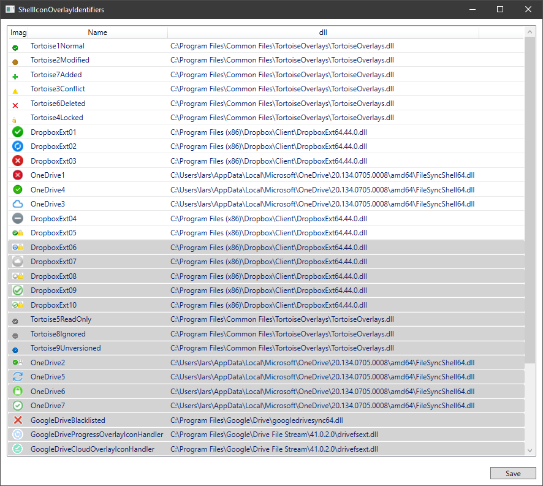

# ShellIconOverlayIdentifiers
ShellIconOverlayIdentifiers sort and prioritize your ShellIconOverlayIdentifiers

Windows has a strange 14-16 icon overlay limit. That is a problem when you are using multiple apps that all wants to be the dominant overlay provider. Windows only picks the 16 first entries from Computer\HKEY_LOCAL_MACHINE\SOFTWARE\Microsoft\Windows\CurrentVersion\Explorer\ShellIconOverlayIdentifiers so different programs have started adding a lot of spaces in front of the key name to ensure that they get picked first. 

This tools gives an easy access to reorder the entries. 

Drag and drop code by Josh Smith
https://www.codeproject.com/Articles/17266/Drag-and-Drop-Items-in-a-WPF-ListView