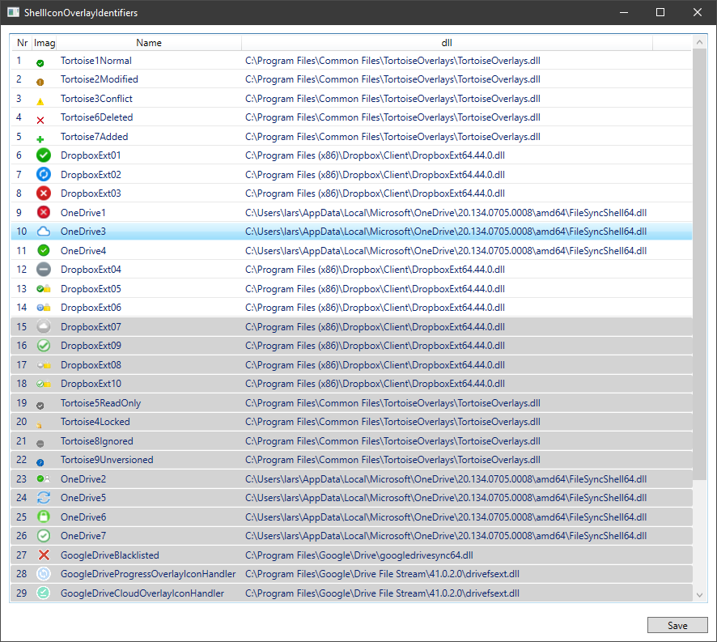

# ShellIconOverlayIdentifiers
ShellIconOverlayIdentifiers sort and prioritize your ShellIconOverlayIdentifiers

Windows has a strange 14-16 icon overlay limit. That is a problem when you are using multiple apps that all wants to be the dominant overlay provider. Windows only picks the 16 first entries from Computer\HKEY_LOCAL_MACHINE\SOFTWARE\Microsoft\Windows\CurrentVersion\Explorer\ShellIconOverlayIdentifiers so different programs have started adding a lot of spaces in front of the key name to ensure that they get picked first. 

* HKEY_LOCAL_MACHINE\SOFTWARE\Microsoft\Windows\CurrentVersion\Explorer\ShellIcon‌OverlayIdentifiers
* HKEY_LOCAL_MACHINE\SOFTWARE\Wow6432Node\Microsoft\Windows\CurrentVersion\explor‌er\ShellIconOverlayIdentifiers

This tools gives an easy access to reorder the entries by drag and drop.

Resulting registry. Items are added with a number of spaces to make sure that they are sorted properly.

Icons are found in the "icons" subfolder and not in the dll. You can add your own. Some of them might be incorrect as I had to guess the connection between the name and the icon number. I'm sure they can be pulled from the dll, but I haven't bothered.

Some registry entries might be write protected, so they will be skipped. You can't rename a registry key, so the only way to do reorder them, is to create a new and copy the content to the new registry key and then deleting the old.

Drag and drop code by Josh Smith
https://www.codeproject.com/Articles/17266/Drag-and-Drop-Items-in-a-WPF-ListView